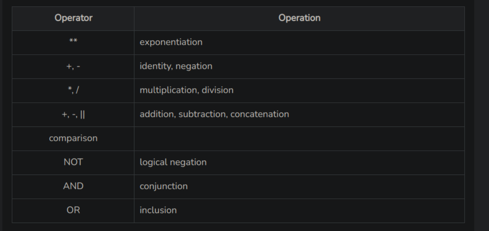

# INDEX

- [INDEX](#index)
- [Syntax for foreign key](#syntax-for-foreign-key)
  - [Composite foreign keys](#composite-foreign-keys)
- [`HAVING and `GROUP BY\`](#having-and-group-by)
- [Correlated Sub-query Examples](#correlated-sub-query-examples)
  - [Example 1](#example-1)
  - [Example 2](#example-2)
  - [Example 3](#example-3)
- [Working with Date and Time in Oracle SQL](#working-with-date-and-time-in-oracle-sql)
- [PL SQL](#pl-sql)
  - [DECLARE section](#declare-section)
    - [Syntax for variable declaration](#syntax-for-variable-declaration)
    - [`%type` declaration](#type-declaration)
  - [Displaying output](#displaying-output)
  - [Executable section (between BEGIN and END)](#executable-section-between-begin-and-end)
    - [`SELECT INTO` clause](#select-into-clause)
    - [PL SQL Operator Precedence](#pl-sql-operator-precedence)
    - [Conditional Statements](#conditional-statements)
      - [`IF-THEN` statement](#if-then-statement)
      - [`IF-THEN-ELSE` statement](#if-then-else-statement)
      - [`IF-THEN-ELSIF` statement](#if-then-elsif-statement)
      - [`CASE` statement](#case-statement)
      - [Nested `IF-THEN-ELSE` statement](#nested-if-then-else-statement)


# Syntax for foreign key

CREATE TABLE FREQUENTS (
  NAME VARCHAR2(30) PRIMARY KEY,
  FOREIGN KEY(NAME) REFERENCES PERSON(NAME),
)

## Composite foreign keys

If a table has a composite primary key, example: (name, age),
name and age have to be referenced as foreign key together, not separately.

# `HAVING and `GROUP BY`

GROUP BY is always needed whenever we need to use the HAVING clause.

HAVING clause is for directly using aggregate functions in condition: HAVING COUNT(*) > 1
Where clause is used when we want to use aggregate functions in an indirect way: WHERE price = (select min(price) from items)

# Correlated Sub-query Examples

## Example 1

Get all employees whose salary is higher than the average salary in their department.

```sql
SELECT emp_name, salary, department
FROM employees e
WHERE salary > (
    SELECT AVG(salary)
    FROM employees
    WHERE department = e.department
);
```

In this example, the subquery calculates the average salary for each department and compares it with the salary of each employee in the outer query.

## Example 2

Find customers who have made more than one order.

```sql
SELECT customer_name
FROM customers c
WHERE (
    SELECT COUNT(*)
    FROM orders
    WHERE customer_id = c.customer_id
) > 1;
```

In this example, the subquery counts the number of orders for each customer in the outer query and returns only those customers who have made more than one order.

## Example 3

Retrieve employees whose hire date is later than the hire date of their manager.

```sql
SELECT emp_name, hire_date, manager_id
FROM employees e
WHERE hire_date > (
    SELECT hire_date
    FROM employees
    WHERE emp_id = e.manager_id
);
```

In this example, the subquery fetches the hire date of the manager for each employee in the outer query and filters out employees whose hire date is later than their manager's hire date.

Correlated subqueries are useful when you need to perform row-by-row comparisons or when the subquery depends on values from the outer query.

# Working with Date and Time in Oracle SQL

| Name |	Description |
|-|-|
| `CURRENT_DATE()` | Return the current date |
| `CURRENT_TIME()` | Return the current time |
| `DATE()` | Extract the date part of a date or datetime expression |
| `DATEDIFF()` | Subtract two dates |
| `HOUR()` | Extract the hour |
| `MINUTE()` | Return the minute from the argument |
| `MONTH()` | Return the month from the date passed |
| `NOW()` | Return the current date and time |
| `SEC_TO_TIME()` | Converts seconds to 'hh:mm:ss' format |
| `SECOND()` | Return the second (0-59) |
| `TO_DATE()` | Convert a string to a date. `TO_DATE('01-JUN-14', 'DD-MON-YY')` |
| `SYSDATE()` | Return the time at which the function executes |
| `TIME()` | Extract the time portion of the expression passed |
| `TIMEDIFF()` | Subtract time |
| `TO_DAYS()` | Return the date argument converted to days |
| `TO_SECONDS()` | Return the date or datetime argument converted to seconds since Year 0 |
| `WEEK()` | Return the week number |
| `WEEKDAY()` | Return the weekday index |
| `YEAR()` | Return the year |

# PL SQL

## DECLARE section
  
- Optional
- Variables defined here.
  
### Syntax for variable declaration

  - variable_name [CONSTANT] datatype [NOT NULL] [:= | DEFAULT initial_value] 
  - x CONSTANT int NOT NULL DEFAULT 2
  - y varchar2(20) := 'hello world'

### `%type` declaration

- The `%type` syntax in PL/SQL is used to declare a variable with the same data type as a specific column in a table. 

  For example:
  ```sql
  DECLARE
    c_id customers.id%type := 1; 
    c_name  customers.name%type; 
    c_addr customers.address%type; 
    c_sal  customers.salary%type; 
  ```

- In the provided code snippet, `%type` is used to declare variables `c_name`, `c_addr`, `c_sal` with the same data types as the respective columns `name`, `address`, and `salary` in the `customers` table.

- By using `%type`, you ensure that the declared variables have the same data type as the corresponding table columns. 
  
  This provides type safety and avoids potential data type inconsistencies in your PL/SQL code. 

- If the data type of the table column changes, the variables declared using `%type` will automatically update to match the new data type, ensuring compatibility between the variables and the table structure.

---

## Displaying output

- `dbms_output.put_line()` used for displaying output. 
- `||` is used for concatenating strings enclosed in '' and variables, like this:

  ```sql
  dbms_output.put_line('this is value of c:' || c);
  ```

---

## Executable section (between BEGIN and END)

- Mandatory

### `SELECT INTO` clause

```sql
DECLARE 
   c_id customers.id%type := 1; 
   c_name  customers.name%type; 
   c_addr customers.address%type; 
   c_sal  customers.salary%type; 
BEGIN 
   SELECT name, address, salary INTO c_name, c_addr, c_sal 
   FROM customers 
   WHERE id = c_id;  
   dbms_output.put_line('Customer ' ||c_name || ' from ' || c_addr || ' earns ' || c_sal); 
END; 
```

The above code will display the information of only one customer that matches the condition in the WHERE clause (`id = c_id`). 

If multiple customers have the same `id` value as `c_id`, the SELECT statement will still retrieve data only for the first matching row. 

The code does not handle multiple matches or iterate through multiple results.

### PL SQL Operator Precedence



### Conditional Statements

#### `IF-THEN` statement

- Example 1:
  ```sql
  DECLARE 
   a number(2) := 10; 
  BEGIN 
    a:= 10; 
    -- check the boolean condition using if statement  
    IF( a < 20 ) THEN 
        -- if condition is true then print the following   
        dbms_output.put_line('a is less than 20 ' ); 
    END IF; 
    dbms_output.put_line('value of a is : ' || a); 
  END; 
  /
  ```

- Example 2:
  ```sql
  DECLARE 
   c_id customers.id%type := 1; 
   c_sal  customers.salary%type; 
  BEGIN
    SELECT salary  
    INTO  c_sal 
    FROM customers 
    WHERE id = c_id; 
    IF (c_sal <= 2000) THEN 
        UPDATE customers  
        SET salary =  salary + 1000 
          WHERE id = c_id; 
        dbms_output.put_line ('Salary updated'); 
    END IF; 
  END; 
  /
  ```

#### `IF-THEN-ELSE` statement

Example:
```sql
DECLARE 
   a number(3) := 100; 
BEGIN 
   -- check the boolean condition using if statement  
   IF( a < 20 ) THEN 
      -- if condition is true then print the following   
      dbms_output.put_line('a is less than 20 ' ); 
   ELSE 
      dbms_output.put_line('a is not less than 20 ' ); 
   END IF; 
   dbms_output.put_line('value of a is : ' || a); 
END; 
/
```

#### `IF-THEN-ELSIF` statement

```sql
DECLARE 
   a number(3) := 100; 
BEGIN 
   IF ( a = 10 ) THEN 
      dbms_output.put_line('Value of a is 10' ); 
   ELSIF ( a = 20 ) THEN 
      dbms_output.put_line('Value of a is 20' ); 
   ELSIF ( a = 30 ) THEN 
      dbms_output.put_line('Value of a is 30' ); 
   ELSE 
       dbms_output.put_line('None of the values is matching'); 
   END IF; 
   dbms_output.put_line('Exact value of a is: '|| a );  
END; 
/ 
```

#### `CASE` statement

```sql
DECLARE 
   grade char(1) := 'A'; 
BEGIN 
   CASE grade 
      when 'A' then dbms_output.put_line('Excellent'); 
      when 'B' then dbms_output.put_line('Very good'); 
      when 'C' then dbms_output.put_line('Well done'); 
      when 'D' then dbms_output.put_line('You passed'); 
      when 'F' then dbms_output.put_line('Better try again'); 
      else dbms_output.put_line('No such grade'); 
   END CASE; 
END; 
/
```

#### Nested `IF-THEN-ELSE` statement

```sql
DECLARE 
   a number(3) := 100; 
   b number(3) := 200; 
BEGIN 
   -- check the boolean condition  
   IF( a = 100 ) THEN 
   -- if condition is true then check the following  
      IF( b = 200 ) THEN 
      -- if condition is true then print the following  
      dbms_output.put_line('Value of a is 100 and b is 200' ); 
      END IF; 
   END IF; 
   dbms_output.put_line('Exact value of a is : ' || a ); 
   dbms_output.put_line('Exact value of b is : ' || b ); 
END; 
/ 
```

---

